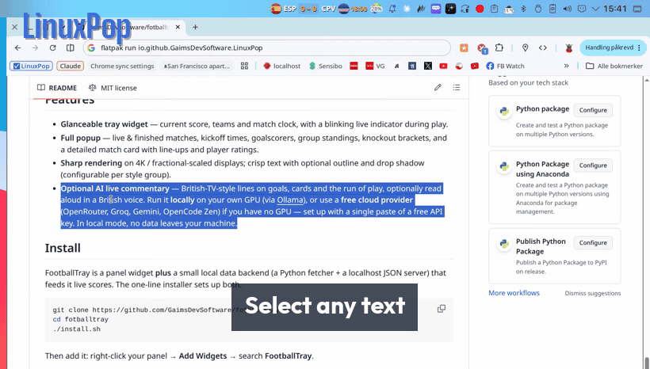

# LinuxPop

> A PopClip-inspired floating action popup for Linux.



Select any text on your screen - LinuxPop pops up a small bar of context-aware
actions right above the selection. Copy, open URLs, run shell commands, ask an
AI, encode/decode, calculate - all without leaving the keyboard or mouse where
your work is.

Works on X11 (Cinnamon, GNOME on X11, KDE, XFCE, MATE, ...) **and on
KDE Plasma 6 / Wayland** (Fedora KDE and friends - see
[docs/FEDORA-KDE.md](docs/FEDORA-KDE.md)). Free, open source, no accounts,
no telemetry.

> **⚠️ On Linux Mint / Cinnamon (and other X11 desktops): treat 0.9.0 as a beta.**
> This release's testing and polish focused on KDE Plasma 6 / Wayland. The X11
> path — including Linux Mint Cinnamon, where LinuxPop started — is preserved
> but hasn't been fully re-verified on real hardware in this version, so some
> features may not behave as intended there yet. **Please [report bugs](https://github.com/GaimsDevSoftware/linuxpop/issues)** —
> feedback is very welcome and directly shapes the road to 1.0.

---

## Features

- **Context-aware actions** - different buttons for URLs, shell commands, plain
  text, paths and emails
- **Global hotkey** - summon the popup on the current selection from any app
- **System tray icon** - quick access to settings, plugin manager and toggle
- **Plugin system** - drop a `.py` file in `~/.config/linuxpop/plugins/` or
  install from the built-in catalog
- **Bundled plugins** - Base64, JSON pretty-print, URL encode/decode,
  calculator, case conversion, slugify, QR codes, in-place translation,
  send-to-AI, local Ollama AI, run-in-terminal for command-like selections
- **Double-click trigger** - hold a modifier and double-click a word to pop
  the action bar (works on native Wayland, not just XWayland)
- **No data leaves your machine** unless a plugin explicitly does so (e.g.
  "Send to Claude" opens it via the `claude://` desktop deep link, or your
  browser as a fallback)

---

## Install

### Flatpak (recommended — KDE Plasma 6 / Wayland & X11)

LinuxPop ships as a **GPG-signed Flatpak from its own auto-updating repo** — one command,
no Flathub account or approval needed:

```sh
flatpak install --from https://gaimsdevsoftware.github.io/linuxpop-flatpak/linuxpop.flatpakref
flatpak run io.github.GaimsDevSoftware.LinuxPop
```

First time using Flatpak? Add the Flathub runtimes first:
`flatpak remote-add --if-not-exists flathub https://flathub.org/repo/flathub.flatpakrepo`

Prefer a single file? Grab the `.flatpak` bundle from the
[latest release](https://github.com/GaimsDevSoftware/linuxpop/releases/latest) and run
`flatpak install --bundle linuxpop-*.flatpak`. Full instructions:
<https://gaimsdevsoftware.github.io/linuxpop-flatpak/>

> In the Flatpak build, "open file/folder" works (read-only home access); screen OCR
> isn't bundled yet (planned for a later release).

### Native packages

**Debian · Ubuntu · Linux Mint** — grab `linuxpop_*_all.deb` from the
[latest release](https://github.com/GaimsDevSoftware/linuxpop/releases/latest):

```sh
sudo apt install ./linuxpop_0.9.2_all.deb
```

**Fedora (COPR)** — native RPM with `dnf` updates:

```sh
sudo dnf copr enable gaimsdevsoftware/linuxpop
sudo dnf install linuxpop
```

### From source

#### 1. System dependencies

```sh
# Ubuntu / Linux Mint / Debian
sudo apt-get install -y python3 python3-gi python3-gi-cairo gir1.2-gtk-3.0 \
    gir1.2-ayatanaappindicator3-0.1 xclip xdotool xdg-utils python3-xlib

# Fedora
sudo dnf install -y python3 python3-gobject gtk3 \
    libayatana-appindicator-gtk3 xclip xdotool xdg-utils python3-xlib

# Arch
sudo pacman -S python python-gobject gtk3 libayatana-appindicator \
    xclip xdotool xdg-utils python-xlib
```

Optional: `qrencode` (for the QR plugin), `ollama` (for the local-AI plugin).

#### 2. Install LinuxPop

```sh
git clone https://github.com/GaimsDevSoftware/linuxpop.git ~/linuxpop
cd ~/linuxpop
bash install.sh
```

`install.sh` sets up autostart and verifies dependencies. Start it now without
logging out:

```sh
python3 ~/linuxpop/main.py
```

To uninstall:

```sh
bash ~/linuxpop/install.sh --uninstall
```

---

## Usage

- **Select text in any X11 app** → popup appears above your selection
- **Hotkey** (default `Super+Shift+Y`) → popup appears at the cursor with the
  current selection
- **Esc**, **click outside**, or wait a few seconds → popup goes away
- **Tray icon** → toggle auto-popup, open Settings, manage Plugins

### Settings

Right-click the tray icon → **Settings**. Or hand-edit
`~/.config/linuxpop/settings.json`.

| Key | Default | Description |
|---|---|---|
| `hotkey` | `super+shift+y` | Combo to summon popup. Record via Settings dialog. |
| `hotkey_source` | `primary` | `primary` (highlighted) or `clipboard` |
| `show_on_selection` | `true` | Auto-popup when you select text |
| `auto_hide_initial_ms` | `8000` | Hide if mouse never reaches popup |
| `auto_hide_leave_ms` | `4000` | Hide this long after mouse leaves the safe zone |
| `min_selection_length` | `1` | Ignore selections shorter than this |
| `terminal_keep_open` | `true` | Keep terminal open after running a command |
| `ai_paste_delay_seconds` | `2.5` | Wait before auto-pasting into a chat AI |
| `double_click_popup_enabled` | `false` | Hold a modifier + double-click a word to pop the bar |
| `double_click_modifier` | `ctrl` | Modifier for the double-click trigger (`ctrl`/`alt`/`super`/`shift`) |
| `translate_target_lang` | `en` | Target language for the Translate plugin (ISO code) |
| `editable_atspi_listener_enabled` | `false` | Use AT-SPI for editable detection + selection geometry |
| `popup_anchor_to_selection` | `true` | Anchor popup to the selection rect (needs AT-SPI enabled) |

### Plugins

Open **Plugins…** from the tray menu to install/remove built-in plugins, or
drop your own `.py` file into `~/.config/linuxpop/plugins/`.

A plugin file just needs a top-level `register(register_plugin)` function:

```python
from classifier import ContentType
from plugin_base import Plugin

def _handler(text: str) -> None:
    print("got:", text)

def register(register_plugin) -> None:
    register_plugin(Plugin(
        name="my-plugin",
        icon="emblem-favorite",
        tooltip="Do something",
        handler=_handler,
        content_types=(ContentType.PLAIN_TEXT,),
        priority=50,
    ))
```

See [CONTRIBUTING.md](CONTRIBUTING.md) for the full plugin API.

---

## Limitations

- **Linux Mint / Cinnamon & X11 are beta in 0.9.0.** The recent work centred
  on KDE Plasma 6 / Wayland; the X11 backend (Cinnamon, GNOME-on-X11, XFCE,
  MATE, …) still works but wasn't fully re-tested on real hardware this cycle.
  Expect rough edges and please file issues — it's the fastest way to get
  your setup solid for 1.0.
- **Wayland support is KDE Plasma only (for now).** LinuxPop has a native
  Wayland backend for KDE Plasma 6 (selection via `wl-clipboard`, popup
  placement via `gtk-layer-shell`, cursor position via KWin's scripting API).
  Other Wayland compositors (GNOME, wlroots) fall back to the X11 path under
  XWayland. See [docs/FEDORA-KDE.md](docs/FEDORA-KDE.md). On Wayland/KDE the
  global hotkey uses KGlobalAccel (verify it binds in System Settings →
  Shortcuts), key injection (paste) goes through `ydotool`, and the
  active-window blocklist is not yet wired up. Popup placement, hover
  persistence, and click-outside dismissal all work natively. Anchoring the
  popup to the selected-text rectangle (rather than the mouse) is available
  when desktop accessibility / AT-SPI is enabled.
- **HiDPI** - works, but tested mainly on 2× scaling. File an issue if
  positioning is off on your setup.
- **Some panel grabs** - if another app holds an X11 input grab (e.g. an open
  menu), the popup may not catch outside-clicks instantly.

---

## License

MIT - see [LICENSE](LICENSE).
